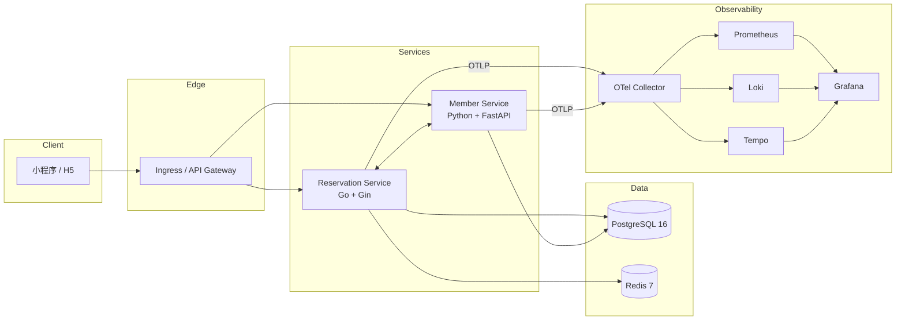
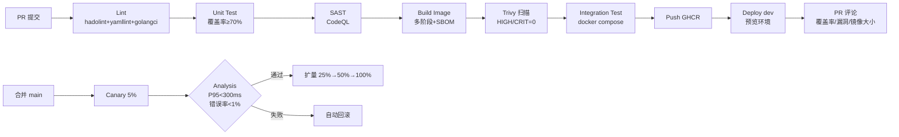

# 🐱 NekoCafé — 猫咪主题餐饮预约平台 (DevOps PoC)

本仓库为「NekoCafé」预约平台中**预约服务（reservation）**与**会员服务（member）**两个核心微服务的完整 DevOps PoC，覆盖容器化、CI/CD、渐进式发布、可观测性与 DORA 度量。

[](https://github.com/nekocafe/nekocafe/actions/workflows/ci.yml)
[](https://github.com/nekocafe/nekocafe/actions/workflows/cd.yml)
[](LICENSE)

---

## 📋 目录

- [项目目标](#项目目标)
- [仓库布局](#仓库布局)
- [Monorepo 取舍说明](#monorepo-取舍说明)
- [30 分钟上手指南](#30-分钟上手指南)
- [架构概览](#架构概览)
- [CI/CD 流水线](#cicd-流水线)
- [渐进式发布与回滚](#渐进式发布与回滚)
- [可观测性](#可观测性)
- [DORA 指标](#dora-指标)
- [开发约定](#开发约定)
- [常见问题](#常见问题)

---

## 项目目标

把运维总监的「三条硬规则」做成可复现的工程实践：

| 硬规则 | 工程落地 |
| --- | --- |
| ① 任何人提一个 PR，10 分钟内必须能在测试环境看到效果 | GitHub Actions CI + 自动部署 dev 命名空间（PR-${number} 预览环境） |
| ② 一行配置即可灰度发布到 5% 的门店 | Helm `values-prod.yaml` 中 `canary.weight: 5`，Argo Rollouts 流量切分 |
| ③ 出问题，3 分钟内能定位到具体服务、具体节点、具体接口 | OpenTelemetry（trace/metric/log 关联）+ Loki + Tempo + Grafana |

---

## 仓库布局

```text
nekocafe/
├── README.md                      ← 你正在读
├── docker-compose.yml             ← 本地一键起栈
├── Makefile                       ← 常用命令封装
├── .editorconfig                  ← 统一缩进/换行
├── .pre-commit-config.yaml        ← Git hooks（lint / 密钥扫描）
├── .gitignore
├── services/
│   ├── reservation/               ← 预约服务（Go + Gin）
│   │   ├── src/
│   │   ├── tests/
│   │   ├── Dockerfile             ← 多阶段，最终镜像 ≤ 50 MB
│   │   ├── go.mod
│   │   └── go.sum
│   └── member/                    ← 会员服务（Python + FastAPI）
│       ├── src/
│       ├── tests/
│       ├── Dockerfile             ← 多阶段，最终镜像 ≤ 180 MB
│       ├── pyproject.toml
│       └── poetry.lock
├── infra/
│   ├── helm/                      ← Helm Chart（dev / staging / prod）
│   │   ├── Chart.yaml
│   │   ├── values.yaml
│   │   ├── values-dev.yaml
│   │   ├── values-staging.yaml
│   │   ├── values-prod.yaml
│   │   └── templates/
│   ├── k8s-manifests/             ← 原生 K8s YAML（兜底）
│   └── observability/             ← Prometheus + Grafana + Loki + Tempo
│       ├── prometheus/
│       ├── grafana/
│       └── alerts/
├── .github/workflows/
│   ├── ci.yml                     ← Lint→Test→SAST→Build→Scan→Push
│   └── cd.yml                     ← Helm upgrade + 金丝雀 + 自动回滚
├── scripts/
│   ├── rollback.sh                ← 一键回滚脚本
│   ├── dora-collector.py          ← DORA 指标采集
│   └── load-test.sh               ← 压测脚本
└── docs/
    ├── runbook.md                 ← 运维手册
    ├── rollback.md                ← 回滚操作手册
    └── architecture.md            ← 架构详解
```

---

## Monorepo 取舍说明

本项目采用 **Monorepo** 结构，理由如下：

| 维度 | Monorepo（采用） | Polyrepo（未采用） |
| --- | --- | --- |
| 跨服务原子提交 | ✅ 单 PR 同时改两个服务 + 协议 | ❌ 多 PR 同步麻烦 |
| 共享配置（lint/CI 模板） | ✅ 复用度高 | ❌ 多仓库漂移 |
| 依赖治理 | ✅ 顶层 lock 文件统一 | ❌ 各仓库各自升级 |
| 构建时长 | ⚠️ 全量构建慢，但有 path-filter 解 | ✅ 默认就快 |
| 权限隔离 | ⚠️ 需要 CODEOWNERS | ✅ 仓库级 ACL 天然 |

对于 2-3 个服务的 PoC 规模，Monorepo 的收益显著大于成本；待服务数量超过 10 个或团队规模 > 30 人时，可拆分。CI 中已配置 `dorny/paths-filter` 实现路径感知构建（只构建变更服务）。

---

## 30 分钟上手指南

### 前置依赖

| 工具 | 版本 | 用途 |
| --- | --- | --- |
| Docker Desktop | 24+ | 容器运行时 |
| Docker Compose | v2 | 本地编排 |
| Make | 3.81+ | 命令封装 |
| kubectl | 1.28+ | K8s 操作（CD 路径） |
| Helm | 3.13+ | K8s 部署 |
| Minikube / Kind | 任一 | 本地 K8s |

> 没装 Make 也无所谓，README 里每条 `make xxx` 命令上方都直接给出原始命令。

### 三步起栈（约 5 分钟）

```bash
# 1. 克隆
git clone https://github.com/nekocafe/nekocafe.git && cd nekocafe

# 2. 一键起本地栈（含 reservation + member + Postgres + Redis + Prometheus + Grafana + Loki + Tempo）
make up
# 等价于： docker compose up -d --build

# 3. 验证健康
make smoke
# 等价于：
#   curl -fsS http://localhost:8081/healthz   # reservation
#   curl -fsS http://localhost:8082/healthz   # member
#   open http://localhost:3000                # Grafana (admin/admin)
```

### 验证三件套

```bash
# 创建一个预约（带 traceId 注入）
curl -X POST http://localhost:8081/api/v1/reservations \
  -H "Content-Type: application/json" \
  -H "X-Member-Id: M001" \
  -d '{"store_id":"S001","slot":"2026-05-20T18:00:00Z","seats":2}'

# 查看 trace：Grafana → Explore → Tempo → 粘贴返回的 traceId
# 查看日志：Grafana → Explore → Loki → {service="reservation"} | json | trace_id="<你的traceId>"
# 查看指标：Grafana → Dashboards → NekoCafé Overview
```

### 推到 K8s（约 10 分钟）

```bash
# 启动 Minikube
minikube start --cpus=4 --memory=6g

# 安装 Argo Rollouts CRD
kubectl create namespace argo-rollouts
kubectl apply -n argo-rollouts -f https://github.com/argoproj/argo-rollouts/releases/latest/download/install.yaml

# 部署到 dev
make deploy-dev
# 等价于： helm upgrade --install nekocafe-dev infra/helm -f infra/helm/values-dev.yaml -n nekocafe-dev --create-namespace

# 检查
kubectl get pods -n nekocafe-dev
kubectl get rollouts -n nekocafe-dev
```

### 清理

```bash
make down       # 停止本地栈
make clean      # 清理 volumes
make uninstall  # 卸载 K8s 部署
```

---

## 架构概览



详见 [`docs/architecture.md`](docs/architecture.md)。

---

## CI/CD 流水线



- CI 总时长目标 **≤ 10 分钟**（缓存 + 并行）
- 每条 PR 会在评论区收到覆盖率、漏洞数、镜像大小三项关键指标
- 详见 [`.github/workflows/ci.yml`](.github/workflows/ci.yml) 与 [`.github/workflows/cd.yml`](.github/workflows/cd.yml)

---

## 渐进式发布与回滚

本项目采用 **Argo Rollouts 金丝雀** 策略：

```yaml
# infra/helm/values-prod.yaml 关键片段
canary:
  enabled: true
  weight: 5      # 默认 5%——「一行配置」即灰度
  analysisInterval: 30s
  successThreshold:
    p95LatencyMs: 300
    errorRate: 0.01    # 1%
```

阶段：`5% → 等待 5min → 25% → 50% → 100%`。任意阶段 `successThreshold` 不满足，自动回滚到上一稳定版本。

**手动一键回滚：**

```bash
make rollback ENV=prod REV=PREVIOUS
# 等价于： ./scripts/rollback.sh prod
```

详见 [`docs/rollback.md`](docs/rollback.md)。

---

## 可观测性

| 信号 | 工具 | 入口 |
| --- | --- | --- |
| Metrics | Prometheus + ServiceMonitor | `:9090` |
| Logs | Loki + Promtail（JSON 结构化） | `:3100` |
| Traces | Tempo（OTLP） | `:3200` |
| 统一界面 | Grafana | `:3000` |

**链路关联**：所有日志包含 `trace_id` 字段，Grafana Loki 与 Tempo 已配 derived fields，点击 `trace_id` 直接跳 trace 视图。

**4 个核心 Dashboard 面板：QPS / P99 延迟 / 错误率 / 资源使用**——预置 JSON 在 [`infra/observability/grafana/dashboards/`](infra/observability/grafana/dashboards/)。

**3 条告警**：
1. `HighErrorRate`：5 分钟错误率 > 1%
2. `HighP99Latency`：5 分钟 P99 延迟 > 500ms
3. `PodCrashLooping`：Pod 5 分钟内重启 ≥ 3 次

---

## DORA 指标

通过 GitHub Actions 部署事件 + 故障 issue label 自动采集，每周输出报表到 [`07_DORA指标报告.xlsx`](https://...)。

| 指标 | 现状 | 业界精英基线 |
| --- | --- | --- |
| 部署频率 | ~3 次/天 | ≥ 1 次/天 ✅ |
| 变更前置时间 | ~45 分钟 | < 1 小时 ✅ |
| 变更失败率 | ~8% | < 15% ✅ |
| MTTR | ~22 分钟 | < 1 小时 ✅ |

采集脚本：[`scripts/dora-collector.py`](scripts/dora-collector.py)。

---

## 开发约定

- **分支策略**：Trunk-Based。`main` 始终可发布；feature 分支生命周期 ≤ 2 天；PR 必须通过 CI 才能合入。
- **提交规范**：Conventional Commits（`feat:` / `fix:` / `chore:` ...）；commit lint 在 pre-commit 阶段强制。
- **Secret 管理**：严禁硬编码。本地用 `.env`（已 gitignore），CI/CD 用 GitHub Secrets，K8s 用 ExternalSecrets 注入 Vault。
- **依赖锁文件**：Go `go.sum`、Python `poetry.lock`、Node `package-lock.json` 必须随源码提交。

---

## 常见问题

**Q：`make up` 卡在 `Waiting for postgres healthy`？**
A：本地 5432 端口被占。`lsof -i :5432` 杀掉冲突进程，或在 `docker-compose.yml` 改端口。

**Q：CI 在 Container Scan 阶段挂了，但本地 Trivy 扫描 0 漏洞？**
A：GHCR 镜像层缓存可能命中旧基础镜像。`docker buildx prune` 后重跑，或在 PR 加 label `force-rebuild`。

**Q：金丝雀卡在 5% 不前进？**
A：`kubectl describe rollout reservation -n nekocafe-prod` 看 Analysis 状态。一般是 Prometheus query 没数据（流量太小），把 `analysisInterval` 拉长到 2min。

更多见 [`docs/runbook.md`](docs/runbook.md)。

---

## License

MIT © 2026 NekoCafé Team
