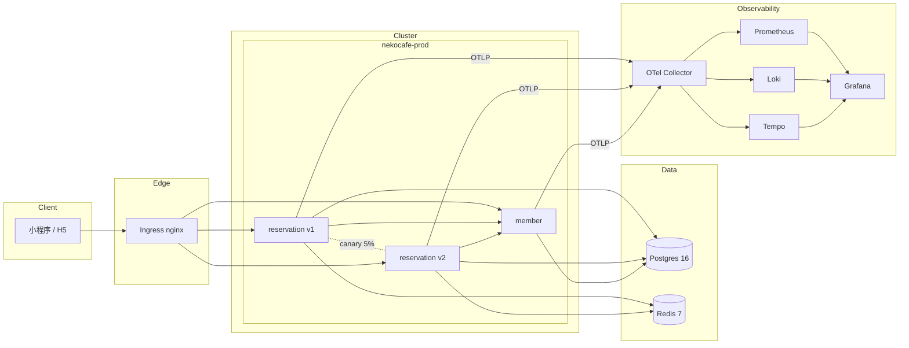
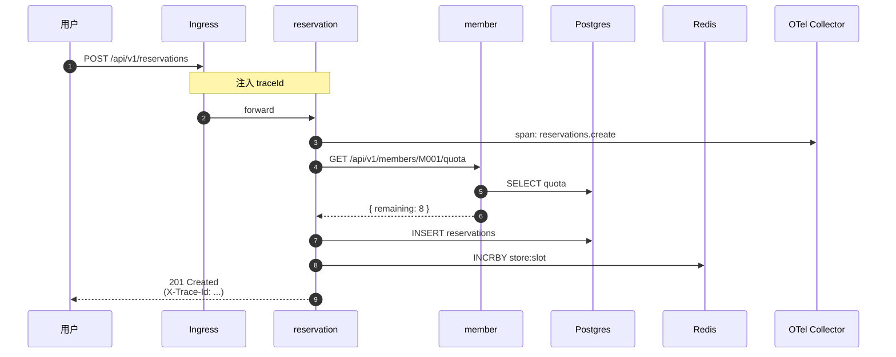

# Architecture — NekoCafé DevOps PoC

## 1. 范围

本 PoC 包含两个核心服务：

- **reservation**（Go + Gin）—— 门店时段预订、座位管理
- **member**（Python + FastAPI）—— 会员档案、月度预约额度

这是实验二完整架构的子集，目标是把 DevOps 链路打通；其余 12 个服务的引入由后续实验完成。

## 2. 运行时拓扑



## 3. 数据流（一次预约）



注意：reservation 与 member 之间的 HTTP 调用 traceparent 由 `otel.GetTextMapPropagator().Inject` 自动透传，trace 在 Tempo 中是同一条。

## 4. 环境拓扑

| 环境 | 命名空间 | 副本 | 数据 | 流量 |
| --- | --- | --- | --- | --- |
| dev | nekocafe-dev | 1/1 | 共享开发库 | PR 预览 + 联调 |
| staging | nekocafe-staging | 2/2 | 影子库（每日复制 prod schema） | 真流量回放 |
| prod | nekocafe-prod | 4/4 + HPA | 独立主从 | 真用户 |
| PR 预览 | nekocafe-pr-${num} | 1/1 | 共享 dev 库 | 仅 PR 评审 |

数据隔离原则：**生产数据永不进 dev/staging**。staging 用脱敏后的镜像数据；dev 用合成数据。

## 5. 分支策略：Trunk-Based

```
main ─●─────●─────●────●────●  ← 始终可发布
       \   /     \    /
        feat-A    feat-B
       (≤ 2 天)   (≤ 2 天)
```

- 所有 feature 分支寿命 ≤ 2 天，否则强制 rebase
- `main` 受保护：CI 全绿 + 2 人 review 才能合
- 不再使用 GitFlow 的 `develop` / `release` 分支：实验显示在 < 30 人团队它会成为瓶颈，与"任何 PR 10 分钟到测试环境"冲突

## 6. 可观测三件套关联

- 所有日志包含 `trace_id` 字段（JSON 结构化）
- Loki datasource 配置了 derived field：日志面板里点 `trace_id` 一键跳 Tempo
- Tempo 配置了 `tracesToLogsV2`：trace 详情页一键跳对应日志
- Prometheus 通过 `service-graphs` + `span-metrics` processor 把 trace 转成 RED 指标

→ 从任一信号出发，3 分钟内可到达其余两个信号。

## 7. 安全基线

| 层 | 措施 |
| --- | --- |
| 镜像 | distroless / slim 基础，非 root 用户（uid 65532），Trivy 必扫，0 HIGH/CRITICAL |
| K8s | runAsNonRoot, readOnlyRootFilesystem, drop ALL capabilities, NetworkPolicy 默认拒绝 |
| Secret | 严禁硬编码；ExternalSecret + Vault；GitHub Secrets 用于 CI 流水线 |
| 流量 | Ingress TLS（cert-manager + Let's Encrypt），prod 强制 HTTPS |
| 代码 | pre-commit gitleaks + CI CodeQL；依赖锁文件 |
